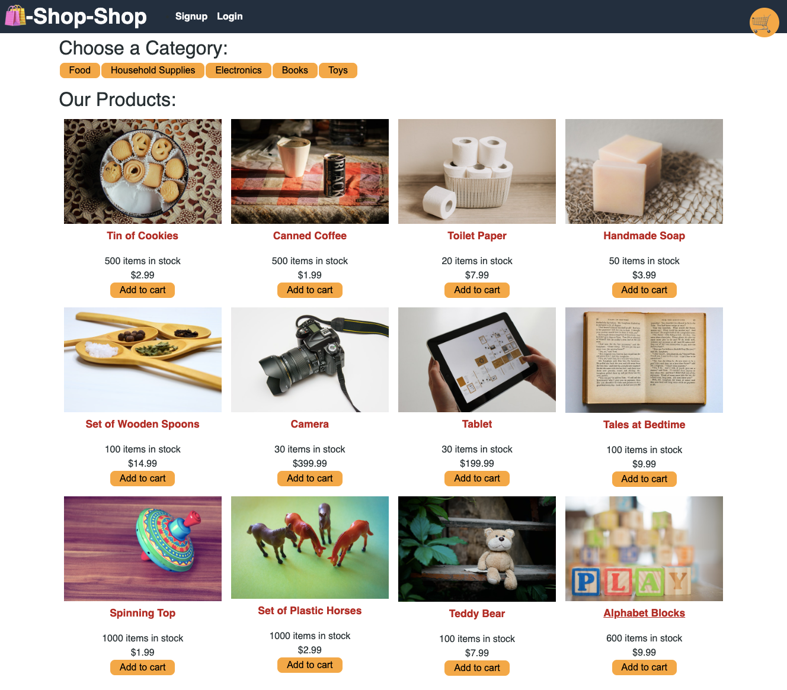

<h1 align="center">State Redux Store</h1>
   
  
<p align="center">
    
    
    
    
</p>
  

## Screenshot



## Deployed App

:atom_symbol: [Heroku App](https://ha-redux-store.herokuapp.com/)
   
## Description
  
🔍 The app was built using the React and Redux.
    
## User Story
  
```
AS a senior engineer working on an e-commerce platform
I WANT my platform to use Redux to manage global state instead of the Context API
SO THAT my website's state management is taken out of the React ecosystem
```
  
## Acceptance Criteria
  
``` 
GIVEN an e-commerce platform that uses Redux to manage global state
WHEN I review the app’s store
THEN I find that the app uses a Redux store instead of the Context API
WHEN I review the way the React front end accesses the store
THEN I find that the app uses a Redux provider
WHEN I review the way the app determines changes to its global state
THEN I find that the app passes reducers to a Redux store instead of using the Context API
WHEN I review the way the app extracts state data from the store
THEN I find that the app uses Redux instead of the Context API
WHEN I review the way the app dispatches actions
THEN I find that the app uses Redux instead of the Context API
```
  
## Table of Contents
- [Description](#description)
- [User Story](#user-story)
- [Acceptance Criteria](#acceptance-criteria)
- [Table of Contents](#table-of-contents)
- [Installation](#installation)
- [Usage](#usage)

## Installation
💾   
  
`npm i`

`npm run build`

`npm run seed`

## Usage
💻   
  
Run the following command at th root of your project and answer the prompted questions:
  
`npm start`